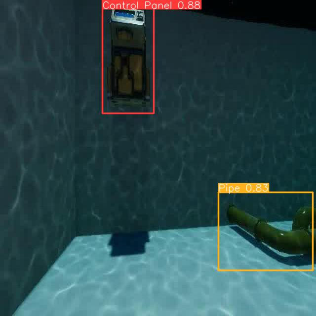

# Underwater Object Detection Using Synthethic Dataset

## Overview

This project focuses on underwater object detection using YOLOv5, leveraging synthetic data from a simulator and real-world data. The process involves collecting data, labeling object instances using Roboflow, training a YOLOv5 model with pretrained weights on the synthetic data, and fine-tuning it on real-world data to improve performance and adaptability.

The fine-tuned model was deployed on a BlueROV and was used to navigate and dock in a testing pool. However, I will only be sharing the sytenthic data and its code due to confidentiality reasons.

## Dataset Collection

### Synthetic Data

Synthetic data was collected using a simulator, providing a diverse set of underwater environments and object instances. This data serves as the foundation for training the initial YOLOv5 model.

### Real-world Data

Real-world data containing the same objects as the syntehtic data were collected to fine-tune the model, enhancing its performance and generalization capabilities. This data introduces real-world variability and challenges to the model.

## Data Labeling

We used Roboflow for labeling object instances in both the synthetic and real-world datasets. This streamlined the labeling process and ensured consistency and accuracy in annotations. The labelled object instances in the synthethic data are

- Control Panel
- Cylinder
- Docking Station
- Pipe
- Shell
- Whale

In contrast, all the object instances except whale are also present in the real-world data.

## Model Training

### YOLOv5 with Pretrained Weights

The YOLOv5 model architecture was chosen for its efficiency and effectiveness in object detection tasks. Pretrained weights were used to initialize the model, leveraging transfer learning to expedite training and improve performance.

### Training on Synthetic Data

The YOLOv5 model was initially trained on the synthetic dataset to learn basic object detection capabilities and gain familiarity with underwater environments and object types. The pretraining was done on Google Colaboratory because of small data footprint.

### Fine-tuning on Real-world Data

To enhance the model's performance and adaptability to real-world scenarios, fine-tuning was performed using the real-world dataset. This process involved adjusting the model's parameters and updating its weights based on the characteristics of real-world data. The finetuning was done using a Nvidia A100 GPU on my school's HPC cluster.

## Evaluation

The trained model's performance was evaluated using mainly the mAP (mean Average Precision) and IoU (Intersection over Union). These were chosen due to the nature of task being modelled.

## Results

Below are some of the predictions from the pretrained model.

## Usage

To use the trained model for underwater object detection:

1. Download or clone the project repository.
2. Install the required dependencies using `pip install -r requirements.txt`.
3. Train a new YOLOv5 model on the synthetic data using the provided scripts or use the provided pretrained weights in `yolov5/runs/train/exp/weights`.
4. Add and preprocess real-world data and annotations if desired.
5. Fine-tune the model on real-world data if desired.
6. Evaluate the trained model's performance on test real-world data.
7. Integrate the model into your application or pipeline for underwater object detection tasks.

## Future Improvements

I do not have any specific plan to improve this project. But you are free to use it as you like.

## Acknowledgments

- Thanks to Roboflow for providing a convenient platform for data labeling.
- Special thanks to the developers of YOLOv5 for their open-source contribution to the computer vision community.
